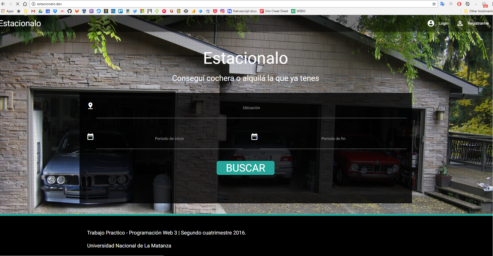
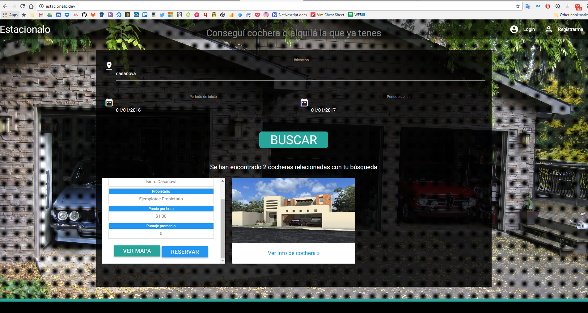
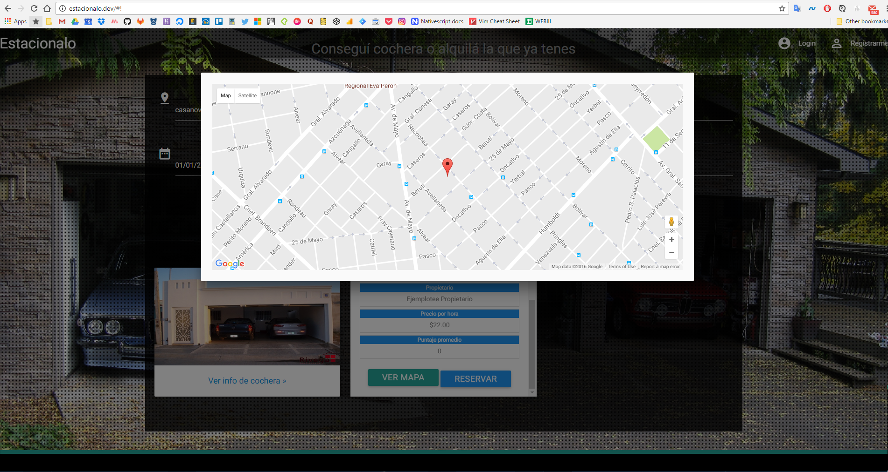
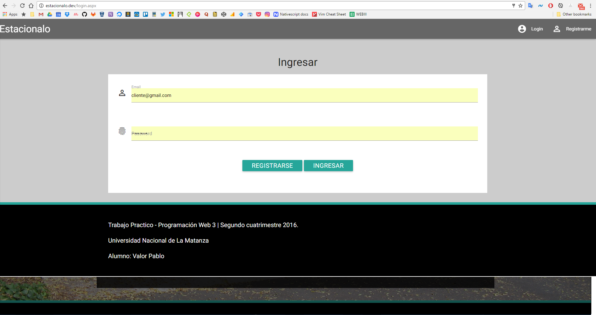
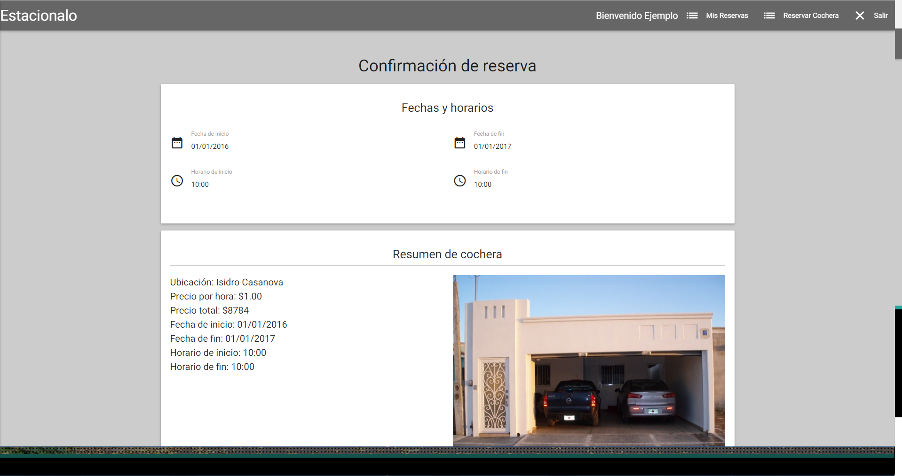
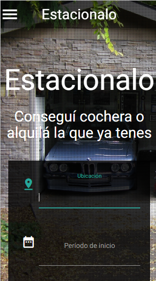
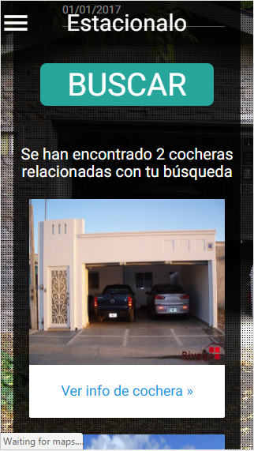

# ProgramacionWebIII
Trabajo Practico de la materia Programación Web 3. UNLaM. 2016.

Hecho con:
  - Visual Studio 2012. Framework 4.5
  - Entity Framework 6
  - SQL Server Express 2008
  - Gulp
  - Sass
  - Bower
  - Jquery 3
  - Materialize

# Capturas

